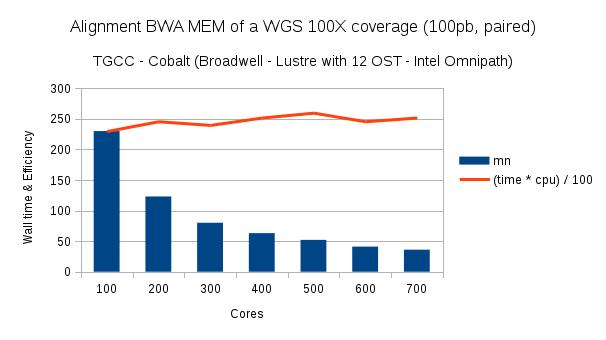

You are in the LAZYCHUNK branch of the mpiBWA project
In this branch we don't precompute offset for the chunk of fatsq reads.
This is fast but less precise.

In memory of Nicolas Joly.

Release notes
------------

Release 1.0 from 17/11/2017

Changes in  LAZYCHUNCK branch

1) Improvement of the algorithm for window sizing.
2) Change the number of bases for the estimation line 541. 

Release 1.0 from 15/11/2017

Changes in LAZYCHUNCK branch

1) Due to mmap of the previous version the virtual memory may be big when the fastq file is large.
Some scheduler like Torque doesn't like this. We review the algorithm of computing chuncks.
first we divide the file in window of size (number of jobs) * 1Gb. On each window we approximate chuncks of 10 mega bases.
this way the virtual memory stay low. 
 
2) We also saw problem on some architecture with MPI file read shared we replace it with MPI file read at. 

3) We have also other projects and we are looking for people willing to help us for developments and tests. Don't hesitate to contact me at frederic.jarlier@curie.fr 

Release 1.0 from 30/06/2017

Major changes:

1) new algorithm. 

We mimic original BWA algorithm when spliting chunk of reads.

In this version 2 workers are responsible for computing offsets chuncks. 
Then offset workers sends the offsets to aligning workers.

To change the number of offset workers modify the line 65 (we will pass it in parameters in the next release).
Adapt the number of offset workers according to the number of aligners.
We have tested 2 offset workers for 80 aligners with a NFS and low ethernet with a good effciency.
 
This version has a low adherence with MPI in order to be compatible with NFS and low ethernet connectors.
Tested with openMPI 2.1.1.

Release 1.0 from 13/06/2017

Update version of bwa 7.15

Release 1.0 from 30/05/2017

To overcome lock contention problem we use a RMA MCS lock inspired from Latham R. et al. (2007). 

Release 1.0 from 17/05/2017

To enhance reproducibility and accuracy we have implemented a new method for read's chunk evaluation. 
The reads chunk sizes are now identical compare to serial BWA-MEM for both trimmed reads or not.

But the algorithm suffers from scalability. The algorithm scales up to 300 cpu (test on Cobalt TGCC) with same speed up than previous version. 
Above that number we encounter lock contention. We are working on a solution now. 
Go back to february 2017 version for more scalability. 
 
Release 1.0 from 20/01/2017

No need to copy the reference genome in /tmp before the mapping. This is done automatically by MPI. 
To change the target directory set $TMPDIR to the new location.

Release 1.0 from 07/11/2016

1) Support for trimmed reads. Works with an even number of jobs. Tested with sample data up to 10 jobs.
Need more test for scalability, load balancing, and evaluation of the chunks sizes.

Introduction
------------

This program optimizes access files and parallelizes the jobs alignment with BWA-MEM alignment v0.7.12.
The input are fasta files of pair reads sequenced with Illumina technology (see sample files). 
Batch of 100M pair bases are loaded and aligned assuring the result is identical to classic BWA-MEM. 

Requirements
------------

You need a C compiler as required for classic BWA program.

You need to install a version of MPI.

You need a mpi compiler too. to check your mpi installation tell in a command window whereis mpirun, normally it is installed in /usr/bin/mpirun.

You need a low latency network and a parallel file system to use this branch

Your reads should be paired or single.

Options
------

All the BWA-MEM options are available in this version, of course according to the bwa release wrapped. 

Known issues:
-------------

Primary hits are reproduced between the serial version and the parallel but you can see differences in mapping position for alternate contigs. 
This problem stems from the randomization of multi-hits reads. When running with the same number of MPI jobs alternative positions are reproduced but when the number of jobs varies the positions can switch for secondary alignments.

How to integrate further version
--------------------------------

This version of mpiBWA has been build with 0.7.12 BWA version.
To integrate the 0.7.13 or 0.7.14:

1) git clone the 0.7.14 of BWA.

2) in the folder of bwa copy-pass the following function from mpiBWA:

makefile
main_parallel_version.c 
pidx.c

then make.

Compilation 
-----------

You need automake 1.15 for the installation.
You can install automake and autoconf in differents directories and export the path like this:
export PATH=../automake-1.15/bin:../autoconf-2.69/bin:$PATH

Download from git. In the folder mpiBWA type:
./configure && make install && make

or for distribution:
make dist
tar xzf .tar.gz
cd pbwa7-1.0
./configure && make install && make

for passing mpi path:
./configure CC=mpi_bin_path
add --prefix in configure if you need 

Results are 2 executables pidx and pbwa7.

Build a reference
-----------------
After the creation of the reference file with BWA, you need to build a mapped reference genome. 
To do that: pidx my_ref.fa (where my_ref.fa has been build with BWA).
Pidx build a reference with the extension .map (my_ref.fa.map). 
This reference will be mapped in share memory.

The pidx needs the following files my_ref.fa.sa, my_ref.fa.bwt, my_ref.fa.ann, my_ref.fa.pac, my_ref.fa.amb to construct the fa.map.
 Those files are generated with bwa index. It works also with the fasta.

How to manage the multithreading
----------------

You have the option to use the multithreading options. 
To do that you fix the number of nodes with mpirun and then the number of threads per nodes with the -t.

Examples:

1 server with 8 threads per server:
mpirun -n 1  pbwa7 mem -t 8... 

2 servers with 10 threads per servers
mpirun -n 2  pbwa7 mem -t 10... 

And so on.

Alignment with a scheduler
------------

Example of bash to run the pbwa7 on Torque scheduler

SPLITTED_READS_DIR=../WholeGenomeSampleReads
MAIL="mymail@toto.fr"
PBS_OUTPUT=../OUTPUT
PBS_ERROR=../ERROR
pBWA_BIN_DIR=../mpiBWA
BWA_REF_TMP=../hg19.fasta
SAMPLENAME="MPIBWA"
FILE_TO_ALIGN_R1=../myread_forward.fastq
FILE_TO_ALIGN_R2=../myread_backward.fastq
TOTAL_PROC=600
OUTPUT_DIR=../RESULTS/
FILE_TO_WRITE=../RESULTS/test.sam

//launch the jobs with torque and one job per core (-t 1)
echo " mpirun -n $TOTAL_PROC $pBWA_BIN_DIR/pbwa7 mem -t 1 -o $FILE_TO_WRITE $BWA_REF_TMP $FILE_TO_ALIGN_R1 $FILE_TO_ALIGN_R2" | qsub -o $PBS_OUTPUT -e $PBS_ERROR -N ${SAMPLENAME} -q batch  -l nodes=40:ppn=15

or launch the jobs with mpirun

mpirun -n $TOTAL_PROC $pBWA_BIN_DIR/pbwa7 mem -t 1 -o $FILE_TO_WRITE $BWA_REF_TMP $FILE_TO_ALIGN_R1 $FILE_TO_ALIGN_R2

Results
-------

Here results wo obtain from test realized with TGCC (Très Grand Centre de Calcul - Bruyères le Chatel - France).

Remarks
-------

1) Do not type the .map extension when you give the reference to pbwa7.

2) Hybrid mode is possible with -t options. MPI rank fix the number of servers and -t options the number of threads per job. 

3) For Lustre or parallel file system users: If you intend to run the mpiSort after the alignment you can tell the striping of the results. 
This is done according to the striping you set in the mpiSort program with the Lustre "lfs setstripe" command (lfs setstripe -c -1 -s 2gb .). 
The "-c -1" option tells Lustre to use all the file system servers and and "-s 2gb" is the size of contigues data blocks. 
For speed purpose reading commands (particularly MPI commands) are aligned on those blocks.

Notes: The striping (like with Hadoop) is the way your data is distributed among servers. This technic accelerates access files and meta file information.

4) Make sure you have the same version of MPI for compiling and running.

5) From our experiences some scheduler do not interpret shared memory and jobs ends up stuck for overloading memory.
In this case take 6gb per job. This is approximately the total reference plus the chunk size.

Future work:
----------

1) Manage the randomization of alternate contigs. To mimic original algorithm.

2) Manage the insert size statistics between jobs.

References:
---------

This work is based on the original bwa aligner written by Li et al.

Li H. and Durbin R. (2010) Fast and accurate long-read alignment with Burrows-Wheeler transform. Bioinformatics, 26, 589-595. [PMID: 20080505] 

Li H. (2013) Aligning sequence reads, clone sequences and assembly contigs with BWA-MEM. arXiv:1303.3997v1 [q-bio.GN]

Latham R. et al. (2007)  Implementing MPI-IO Atomic Mode and Shared File Pointers Using MPI One-Sided Communication Authors

-------

The program has been developed by 

Frederic Jarlier from Institut Curie and 
Nicolas Joly from Institut Pasteur

and supervised by

Philippe Hupe from Institut Curie
