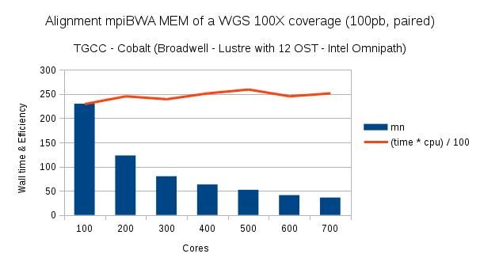

# Documentation

* [Installation](#installation)
* [Prerequisites](#prerequisites)
* [Usage](#usage)
    * [Input](#input)
    * [Options](#options)
    * [Output](#output)
* [Informatic resources](#informatic-resources)
    * [Memory](#memory)
    * [Cpu](#cpu)
* [Examples](#examples)
    * [Standard](#standard)
    * [Slurm](#slurm)
    * [PBS/Torque](#pbstorque)
* [Performance](#performance)
* [Parallel filesystems](#parallel-filesystems)
* [Algorithm](#algorithm)
* [References](#references)


## Installation

Follow the [Installation](INSTALL.md) guidelines to compile and install `mpiBWA`.

## Prerequisites

As `mpiBWA` relies on the Message Passing Interface (MPI) standard, `mpirun` must be available to run the program. Several MPI implementations exist
such as [mpich](https://www.mpich.org/), [open-mpi](https://www.open-mpi.org/) or [Intel® MPI Library](https://software.intel.com/en-us/mpi-library). The `mpirun` program must be available in your PATH.

### Install mpirun on CentOS

* for [open-mpi](https://www.open-mpi.org/): `sudo yum install openmpi openmpi-devel`
* for [mpich](https://www.mpich.org/): `sudo yum install mpich`

### Install mpirun on Ubuntu

* for [open-mpi](https://www.open-mpi.org/): `sudo apt-get install openmpi-bin`
* for [mpich](https://www.mpich.org/): `sudo apt-get install mpich`

## Usage

We have 2 versions of `mpiBWA`:

1. the first version creates a unique SAM file and is available in the binary `mpiBWA`
2. the second version sorts the output by the chromosomes present in the header and is available in the binary `mpiBWAByChr`


After installation, 3 binaries are created:
1. `mpiBWA`
2. `mpiBWAByChr`
3. `mpiBWAIdx`


Note that in what follows, we will only mention how to use the binary `mpiBWA` as the binary `mpiBWAByChr` works the exact same way.


`mpiBWAIdx` is responsible for creating a binary image of the reference genome. This image is subsequently loaded in the shared memory by `mpiBWA`. Then, every `mpiBWA` process on the computing node will share the same genome reference in order to save memory usage. `mpiBWAIdx` does not need MPI to run. To create a binary image from a reference genome type:

`mpiBWAIdx myReferenceGenome.fa`

This creates the file `myReferenceGenome.fa.map`.

Importantly, `mpiBWAIdx` requires the following files: `myReferenceGenome.fa.sa`, `myReferenceGenome.fa.bwt`, `myReferenceGenome.fa.ann`, `myReferenceGenome.fa.pac`, `myReferenceGenome.fa.amb` to build the `fa.map` file. These files are generated by `bwa index` (see [bwa documentation](http://bio-bwa.sourceforge.net/bwa.shtml)). It works also with the fasta.

The [genome.sh](../examples/genome.sh) script provides an example to build the map file.

`mpiBWA` is executed with the `mpirun` program, for example:

`mpirun -n 2 mpiBWA mem -t 8 -o HCC1187C.sam hg19.small.fa examples/data/HCC1187C_R1_10K.fastq examples/data/HCC1187C_R2_10K.fastq`

This command launches 2 processes MPI and 8 threads will be created by mpiBWA.

WARNING: do not write the extension .map for the reference. If the file is `myReferenceGenome.fa.map` just provide in the command line `myReferenceGenome.fa` to `mpiBWA`.

The `-n` options passed to `mpirun` indicates the number of processes to run in parallel (this is basically the number of cores that will be used). For for details on how to choose the number processes, see the [Informatic resources](#informatic-resources) section.

`mpiBWA` requires four mandatory arguments:

* [Input](#input): a reference genome in .map format, one or two fastq files trimmed or not
* [Output](#output): a sam file

If you decide to split by chromosome the output SAM file you give will contain the header, and for each chromosome of the header mpiBWA will yield a SAM file plus a discordant and a unmapped SAM files.

### Input

### Options

### output

## Informatic resources

### Memory

The total memory used during the alignment if approximately the size of the `.map` file plus the size of the sam loaded by each bwa tasks. A bwa thread takes around 300 MB of memory.
 
### Cpu

The number of cores is related to the number of rank of the MPI jobs and to the number of threads you ask with bwa and with the -t option. For example, the command line `mpirun -n 4 mpiBWA mem -t 8 -o HCC1187C.sam hg19.small.fa examples/data/HCC1187C_R1_10K.fastq examples/data/HCC1187C_R2_10K.fastq` will use 32 cores.

## Examples


There are many ways to distribute and bind MPI jobs according to your architecture. We provide below several examples to launch MPI jobs in a standard manner or with a job scheduling system such as [Slurm](https://slurm.schedmd.com/sbatch.html) and [PBS/Torque](https://support.adaptivecomputing.com/support/documentation-index/torque-resource-manager-documentation/).

Two toy dataset (fastq files trimmed or not) are provided in the [examples/data](../examples/data) folder for testing the program. You can use this sample to test the program.

### Standard

`mpirun` can be launched in a standard manner without using any job scheduling systems. For example:

`mpirun -n 4 mpiBWA mem -t 8 -o ${HOME}/mpiBWAExample/HCC1187C.sam ${HOME}/mpiBWAExample/hg19.small.fa examples/data/HCC1187C_R1_10K.fastq examples/data/HCC1187C_R2_10K.fastq` 

If needed, a file with the server name in `-host` option can be provided to `mpirun`. We invite you to read the `mpirun` documentation for more details.

You can go in the [examples](../examples) directory and execute the [standard.sh](../examples/standard.sh) script to test the program.

### Slurm

In order to submit a job using [Slurm](https://slurm.schedmd.com/sbatch.html), you can write a shell script as follows:

```shell
#! /bin/bash
#SBATCH -J MPIBWA_32_JOBS
#SBATCH -N 2                            # Ask 2 nodes
#SBATCH -n 32                           # Total number of cores
#SBATCH -c 16                           # use 16 core per mpi job
#SBATCH --tasks-per-node=16             # Ask 16 cores per node
#SBATCH --mem-per-cpu=${MEM}            # See Memory ressources
#SBATCH -t 01:00:00
#SBATCH -o STDOUT_FILE.%j.o
#SBATCH -e STDERR_FILE.%j.e

mpirun -n 2 mpiBWA mem -t 16 -o ${HOME}/mpiBWAExample/HCC1187C.sam ${HOME}/mpiBWAExample/hg19.small.fa examples/data/HCC1187C_R1_10K.fastq examples/data/HCC1187C_R2_10K.fastq`

```

You can go in the [examples](../examples) directory and submit the job with `sbatch` using the [slurm.sh](../examples/slurm.sh) script to test the program.

### PBS/Torque

In order to submit a job using [PBS/Torque](https://support.adaptivecomputing.com/support/documentation-index/torque-resource-manager-documentation/), you can write a shell script as follows:


```shell
#! /bin/bash
#PBS -N MPIBWA_32_JOBS
#PBS -l nodes=2:ppn=16:mem=${MEM}        # Ask 2 nodes and 16 jobs per node
#PBS -l walltime=24:00:00
#PBS -o STDOUT_FILE.%j.o
#PBS -e STDERR_FILE.%j.e

mpirun i-n 2 mpiBWA mem -t 16 -o ${HOME}/mpiBWAExample/HCC1187C.sam ${HOME}/mpiBWAExample/hg19.small.fa examples/data/HCC1187C_R1_10K.fastq examples/data/HCC1187C_R2_10K.fastq`

```

You can go in the [examples](../examples) directory and submit the job with `qsub` command using the [pbs.sh](../examples/pbs.sh) script to test the program.

## Performance

This parallel version of BWA MEM is meant to be 100% reproducible with original BWA MEM version. It means if you took the same number of threads in the serial version and in the MPI version you will obtain exactly the same results.

Heres an example of the scalability tests we realize with the TGCC (Tres Grand Centre de Calcul - Bruyeres le Chatel - France)  




## Parallel filesystems

This software need a parallel file system for execution. The programm has been tested with Lustre and Beegfs.

WARNING: 

Be aware of the flock mode on parallel file system (Lustre, Beegfs): flock must be on. Otherwise reproducibility is not guaranteed. 


## Algorithm

The algorithm is divided in 3 sections.

In the first section MPI jobs are responsible for creating chunks of reads. All those chunks contain the same number of nucleotids.

In the second section MPI jobs calls aligner jobs. This part invokes BWA MEM algorithm.

In the third section MPI jobs write the alignment results in a SAM file or in individual chromosom SAM files. This part uses shared file pointers.

## References

This work is based on the original bwa aligner written by Li et al.([Burrow-Wheeler Aligner for short-read alignment](https://github.com/lh3/bwa)):

* Li H. and Durbin R. [Fast and accurate long-read alignment with Burrows-Wheeler transform](https://academic.oup.com/bioinformatics/article/26/5/589/211735). Bioinformatics, 2010 ([pdf](https://academic.oup.com/bioinformatics/article-pdf/26/5/589/16896917/btp698.pdf)).

* Li H. [Aligning sequence reads, clone sequences and assembly contigs with BWA-MEM](https://arxiv.org/abs/1303.3997). arXiv:1303.3997v1, 2013 ([pdf](https://arxiv.org/pdf/1303.3997)).

Shared memory with MPI:

* Latham R. et al. [Implementing MPI-IO Atomic Mode and Shared File Pointers Using MPI One-Sided Communication](https://journals.sagepub.com/doi/abs/10.1177/1094342007077859), 2007.


